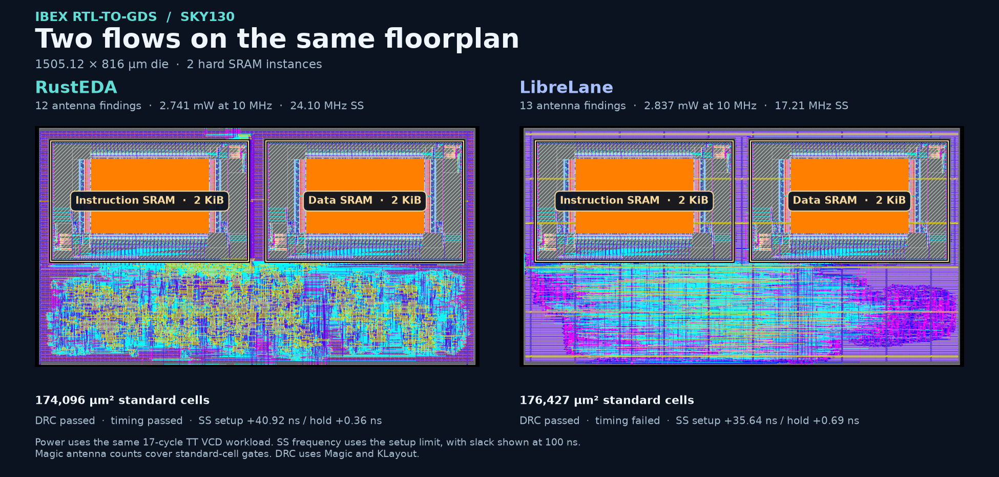
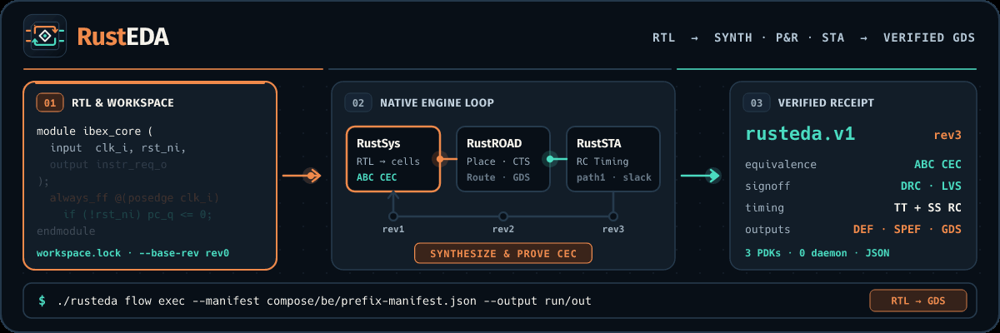

# RustEDA

<p align="center">
  
</p>

**AI agent-friendly RTL-to-GDS in Rust.** RustEDA gives AI agents and engineers
a CLI for synthesis, timing analysis and physical design. An agent can inspect
a plan before running it, watch individual steps and use timing, geometry and
check results to decide what to change next.

**4.4× observed end-to-end speedup** on IHP SG13G2 in the 13 November Ibex
campaign, with **752 s vs 3,283 s** including preparation and verification
on a matched check schedule. The same campaign measured **40.3× synthesis
speedup** and **7.8× routing speedup**.
[Stage timings and check outcomes](#ihp-sg13g2-results)

[Agent workflow](#built-for-ai-agents) ·
[Chip layouts and benchmarks](#ibex-rtl-to-gds-across-three-open-pdks) ·
[Get started](#start-building) ·
[Documentation](https://lab-emi.github.io/RustEDA/)

## Built for AI agents

1. **Plan.** Compose a PDK profile into a hash-pinned step graph.
   `rusteda flow exec --dry-run` resolves the graph and checks the tool,
   input and PDK identities before any step runs.
2. **Run and inspect.** Execute the full graph or stop at a named step with
   `--stop-after`. Stream JSONL progress with `--events` and poll
   `rusteda flow exec-status` from another process. Step receipts record
   timings, logs and failure codes.
3. **Iterate on a known revision.** Revisioned disk workspaces support
   read-only inspection while a worker runs. Mutations require `--base-rev`
   and reject a stale revision with `REVISION_CONFLICT`.
4. **Verify the result.** Runs record the identities of GDS, DEF, netlists
   and SPEF alongside check verdicts. The shared gates report timing,
   equivalence and physical findings for the exported layout.

[Native PDK recipe](integration/ibex_pdks/NATIVE.md) ·
[Workspace operations and recovery](docs/flows.md) ·
[Executor and JSON contract](apps/docs/specs/flow/exec.md)

## Ibex RTL-to-GDS across three open PDKs

**IHP SG13G2 · SKY130A · GF180MCU D.** RustEDA and LibreLane 3.0.17 build
Ibex with hard instruction and data SRAM. Within each PDK both use the same
RTL, 100 ns (10 MHz) constraints, macro views, die area and macro placements
(on SKY130A, RustEDA adds two 7 × 50 µm vertical placement channels not in
LibreLane's config). The panels show the exported published GDS side by side,
with **RustEDA on the left** and **LibreLane on the right**; their embedded
captions retain the original single-run published receipts, while the table
below gives the repeated three-block timings.




Each measurement lists **RustEDA / LibreLane**. Power, area and the SS setup
ceiling measure each flow's **published layout** (the same pair timed in the
one-run column); the last column gives the three-block median against the
**screened LibreLane arm**, which on SKY130A and GF180MCU D is a different,
unmeasured layout (`drt-jumpers`) with far more antenna violations.

| Open PDK | TT 17-cycle workload power at 10 MHz (mW) | Standard-cell area (µm²) | SS setup ceiling at 10 MHz constraints (MHz)¹ | RTL to GDS, published pair, 1 run (s) | RTL to GDS, screened LibreLane arm, median of 3 (s)² |
| --- | ---: | ---: | ---: | ---: | ---: |
| IHP SG13G2, four cores | 1.045 / 1.306<br>**−20.0%** | 186,285 / 204,848<br>**−9.1%** | 43.42 / 24.86<br>**+74.6%** | 219.8 / 1,806.0<br>8.22× | 219.6 / 1,745.5<br>**7.95×** (`antenna-default`, 0 / 0 phys.) |
| SKY130A, two cores³ | 2.741 / 2.837<br>**−3.4%** | 174,096 / 176,427<br>**−1.3%** | 24.10 / 17.21<br>**+40.0%** | 1,660.6 / 1,730.6<br>1.04× (12 / 13 ant.) | 1,665.5 / 1,370.0<br>0.82× (`drt-jumpers`, 12 / 105 ant.) |
| GF180MCU D, two cores | 91.24 / 94.33<br>**−3.3%** | 475,913 / 490,812<br>**−3.0%** | 10.91 / 10.75<br>**+1.5%** | 594.1 / 911.0<br>1.53× (0 / 0 ant.) | 591.3 / 885.6<br>**1.50×** (`drt-jumpers-fill`, 0 / 82 ant.) |

¹ **Not a tight-clock Fmax race:** both flows targeted a relaxed 100 ns (10 MHz) clock with LibreLane on `SYNTH_STRATEGY = "AREA 0"` (+35–49 ns positive slack, zero setup optimization); on SKY130A RustEDA also excludes `_1` cells and applies five pre-bound OR-gate rewires.  
² In the 2026-11-18 runs, no LibreLane arm passed every physical gate on SKY130A or GF180MCU D, so the legacy fallback picked `drt-jumpers` despite 105 and 82 antenna findings (now fixed in `bench.py` to require `no_physical_regression` from baseline for future campaigns). On IHP, through DRC, antenna, latch-up and LVS the three-block medians are **754 / 2,468 s (3.27×)**; LibreLane fails the shared timing gate on electrical limits, and neither flow reaches full signoff on SKY130A or GF180MCU D.  
³ **SKY130A parity caveat:** the SKY130A RustEDA producer is not yet a single clean release flow — it uses Ibex-trained PGO (`-231 s` on cold detailed routing alone; without PGO it is slower than `librelane-recipe`), five distinct `.work` RustROAD binaries, two vertical placement channels not in LibreLane's config, five hardcoded OR-gate rewires and two internal OpenRCX/OpenSTA loops. IHP SG13G2 (single standard `rusteda flow exec`, no PGO, 9/9 gates passed) is the cleanest comparison.
[Fairness audit and known asymmetries](docs/benchmarks/ibex-three-pdk.md#comparison-fairness-and-known-asymmetries) ·
[IHP](docs/benchmarks/ibex-three-pdk.md#repeated-ihp-comparison-at-the-same-signoff) ·
[SKY130A](docs/benchmarks/ibex-three-pdk.md#repeated-sky130a-comparison-at-the-same-signoff) ·
[GF180MCU D](docs/benchmarks/ibex-three-pdk.md#repeated-gf180mcu-d-comparison-at-the-same-signoff) ·
[QoR methods and model limits](docs/benchmarks/ibex-three-pdk.md#power-area-and-timing-margin)

OpenSTA uses the matched 17-cycle workload activity and nominal OpenRCX
parasitics (vectorless 10 MHz power on the aligned layouts is also lower for
RustEDA: 1.21 / 5.57 mW on IHP, 6.56 / 9.50 mW on SKY130A and 79.80 / 139.09 mW
on GF180MCU D). Both SKY130A published layouts passed DRC and recorded **12 / 13**
Magic antenna findings; GF180MCU D recorded **1 / 3** foundry density findings
when both flows end in the same floating fill, which both GF180MCU D times
include. One screening run of each published layout is not a confirmed
difference.
[Three-PDK results and receipts](docs/benchmarks/ibex-three-pdk.md#sky130a-native-local-antenna-repair)

### IHP SG13G2 results

The **13 November** campaign used EZ130 cells and two IHP SRAM macros.
RustEDA and LibreLane ran sequentially on the same 4-vCPU cloud host, using
the same prepared design and shared check scripts. These are paired phase
wall times from that run. The campaign has one timed sample per flow.

| Phase | RustEDA | LibreLane | Observed speedup |
| --- | ---: | ---: | ---: |
| Synthesis and mapping | 3.10 s | 124.93 s | **40.3×** |
| Placement and clock tree | 19.56 s | 41.21 s | **2.1×** |
| Repair before detailed routing | 13.85 s | 48.36 s | **3.5×** |
| Global and detailed routing | 266.71 s | 2,083.40 s | **7.8×** |
| In-flow static timing | 26.96 s | 138.93 s | **5.2×** |
| Parasitic extraction phase | 9.51 s | 38.97 s | **4.1×** |
| GDS, DEF and netlist export phase | 1.67 s | 266.29 s | **159×** |
| **End to end with checks on a matched schedule** | **751.54 s** | **3,283.05 s** | **4.4×** |

RustEDA used **5.2% less standard-cell area** and **7.7% less routed signal
wire** in this campaign. It passed the shared timing gate. LibreLane reported
112 capacitance and fanout violations across both corners and its equivalence
check was unverified. The receipt records `comparison_incomplete`. The
end-to-end ratio uses the observed elapsed times.
Charging every check serially gives **3.5×**. Phase times include each flow's
work for that phase. The LibreLane extraction phase includes fill, IR and
reports, and its export phase includes rendering and XOR. [Phase breakdown and gate outcomes](https://lab-emi.github.io/RustEDA/benchmarks/#ibex-host-campaign-2026-11-13) ·
[Campaign receipt](docs/benchmarks/ibex-sg13g2-ez130-host-20261113.json)

[Standalone engine comparisons and earlier runs](docs/benchmarks.md) cover
other workloads and resource allocations, including extraction results at
two and four threads. The [PULPissimo archive](docs/benchmarks/pulpissimo.md)
records the withdrawal of the historical full-SoC measurements after an AXI
width-cast error.

## The tool suite

| Tool | Role in the design loop |
| --- | --- |
| [RustEDA CLI, flow and Studio](docs/modules.md) | Run steps, track revisions, and inspect hierarchy, paths and logic cones. |
| [RustSys](https://github.com/lab-emi/RustSys) | Synthesize RTL, map cells and check equivalence. |
| [RustSTA](https://github.com/lab-emi/RustSTA) | Analyze timing and constraints with incremental updates. |
| [RustROAD](https://github.com/lab-emi/RustROAD) | Place, build clock trees, route, extract parasitics and export GDS. |
| [RustSpice](https://github.com/lab-emi/RustSpice) | Simulate circuits and compute adjoint sensitivities in separate simulation workloads. |
| [RustEDA Common](https://github.com/lab-emi/RustEDA-Common) | Share formats, design models, disk workspaces and compute kernels. |

<picture>
  <source media="(prefers-reduced-motion: reduce)" srcset="docs/assets/rusteda-banner.svg">
  
</picture>

## Start building

Git, Python 3.11+, Rust 1.100.0 and a native Linux build environment are the
development baseline. Studio has additional native GUI dependencies.

```sh
git clone --recurse-submodules https://github.com/lab-emi/RustEDA.git
cd RustEDA
./dev status
./dev doctor
./dev build RustEDA --release --no-default-features --memory-mib 4096
./rusteda --help
```

The `./dev` entrypoint bounds worker concurrency and memory and records
resource use. [Development guide and engine builds](docs/development.md)

### Inspect an agent's first native run

With a composed benchmark manifest, use the built Rust CLI to inspect the
plan. During execution, `flow exec-status --output run/output` reads progress
and completed step receipts.

```sh
./.work/target/RustEDA/release/rusteda flow exec \
  --manifest compose/be/prefix-manifest.json \
  --project compose/be --output run/output --pdk sky130 --dry-run
```

[Compose a native PDK manifest and start the worker](integration/ibex_pdks/NATIVE.md)

## Run a verified design loop

The repository launcher supports the small-block workspace flow. Supply the
documented pinned tools and PDKs on Linux, with Podman and a user systemd manager.

```sh
./rusteda tools configure
./rusteda tools verify
./rusteda flow --workspace .work/counter init --base-rev empty --design counter --pdk sky130
./rusteda flow --workspace .work/counter run --base-rev rev0
./rusteda flow --workspace .work/counter report --summary-only
```

Small-block physical qualification covers eight designs on SKY130 and GF180,
with 15 ordinary passes and one declared minimum-pulse-width deviation.
See the worker, cache and recovery procedures before using the flow on a new
workspace. [Flow operation](docs/flows.md) · [Qualification scope](docs/verification.md)

## PDKs and standard-cell libraries

Use `./rusteda library --help` to find pinned Liberty corners and
`./rusteda sram sky130 --corner tt` to locate SRAM views and their hashes.
The Ibex benchmarks use EZ130 8T on IHP SG13G2, SKY130 HD and GF180MCU 7T.
[PDK and SRAM setup](docs/pdks.md) · [Benchmark input provenance](integration/ibex_pdks/README.md)

## License and provenance

Apache-2.0. Each module retains its own LICENSE and NOTICE. Benchmark
designs, PDKs, reference executables and rule decks carry their respective
licenses. Reference tools are run as external executables over documented
file interfaces. [License](LICENSE) · [Provenance](docs/provenance.md)
